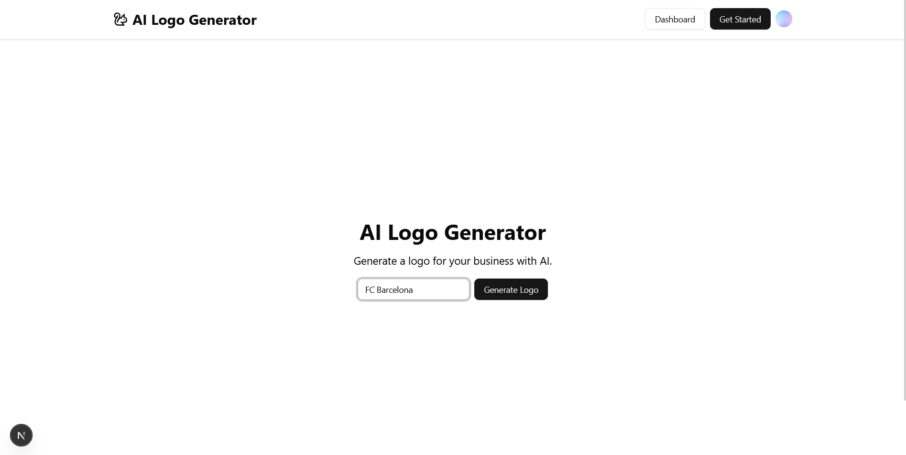
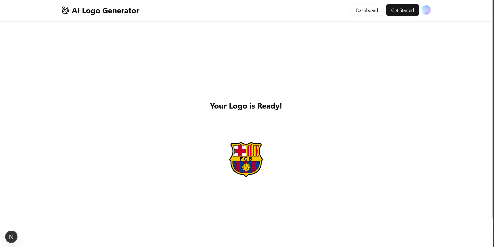
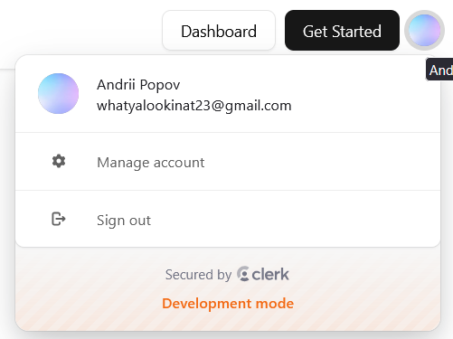

# AI Logo Generator 🎨

A **modern web application** that generates **custom logos** using **AI**, built with **Next.js**, **Clerk**, **Firebase**, and **Google's Gemini AI**. Users can **sign up**, **create logos** with custom prompts, and **manage their generated logos** — all powered by **Firebase services** including **Storage** and **Firestore**.

## 🔍 Description

This app enables users to:
- **Authenticate** via Clerk (Email/Password, Google, etc.)
- **Create logos** with custom titles, descriptions, and color palettes
- **Choose from various design styles** (Cartoon, App, Modern Mascot, etc.)
- **Generate AI-powered logos** using Google's Gemini AI
- **Store and manage** generated logos in a personal dashboard

## 🖼️ Screenshots

### 1. Home Page – Enter Logo Name


### 2. Select Logo Design Style


### 3. Generated Logo Result


### 4. Clerk Authentication Dropdown


## 📁 Project Structure

```
.
├── src/
│   ├── app/           # Next.js app router pages
│   ├── components/    # React components
│   ├── lib/          # Utilities and configurations
│   └── context/      # React context providers
```

## 🚀 Features

- **Clerk Authentication** for secure user management
- **Google Gemini AI** integration for logo generation
- **Firebase Storage** for logo image storage
- **Firebase Firestore** for logo metadata
- **Responsive UI** with TailwindCSS and ShadCN
- **Protected routes** with middleware
- **Multi-step logo creation** process
- **Custom color palette** selection
- **Design style templates**

## 🛠️ Tech Stack

### Frontend

- **Next.js 15** (App Router)
- **React 19**
- **TypeScript**
- **TailwindCSS**
- **ShadCN UI**
- **Clerk** for authentication
- **Lucide Icons**

### Backend

- **Firebase**
  - **Firestore** for database
  - **Storage** for image storage
- **Google Gemini AI** for image generation
- **Next.js API Routes**

## ⚙️ Setup

### 1. Clone the Repo

```bash
git clone https://github.com/andrew-dev-p/ai-logo-generator
cd ai-logo-generator
```

### 2. Install Dependencies

```bash
npm install
```

### 3. Environment Variables

Create a `.env.local` file with:

```env
# Clerk
NEXT_PUBLIC_CLERK_PUBLISHABLE_KEY=your-clerk-publishable-key
CLERK_SECRET_KEY=your-clerk-secret-key

# Firebase
NEXT_PUBLIC_FIREBASE_API_KEY=your-firebase-api-key
NEXT_PUBLIC_FIREBASE_AUTH_DOMAIN=your-firebase-auth-domain
NEXT_PUBLIC_FIREBASE_PROJECT_ID=your-firebase-project-id
NEXT_PUBLIC_FIREBASE_STORAGE_BUCKET=your-firebase-storage-bucket
NEXT_PUBLIC_FIREBASE_MESSAGING_SENDER_ID=your-firebase-messaging-sender-id
NEXT_PUBLIC_FIREBASE_APP_ID=your-firebase-app-id
NEXT_PUBLIC_FIREBASE_MEASUREMENT_ID=your-firebase-measurement-id

# Google Gemini
NEXT_PUBLIC_GEMINI_API_KEY=your-gemini-api-key
```

### 4. Run Development Server

```bash
npm run dev
```

## 🧪 Running Locally

1. Start the development server:
```bash
npm run dev
```

2. Open [http://localhost:3000](http://localhost:3000)

## 🔐 Security

- **Protected Routes**: Middleware ensures authenticated access
- **Secure Storage**: Firebase Storage with user-specific paths
- **Database Security**: Firestore rules for data access control
- **API Keys**: Environment variables for sensitive data
